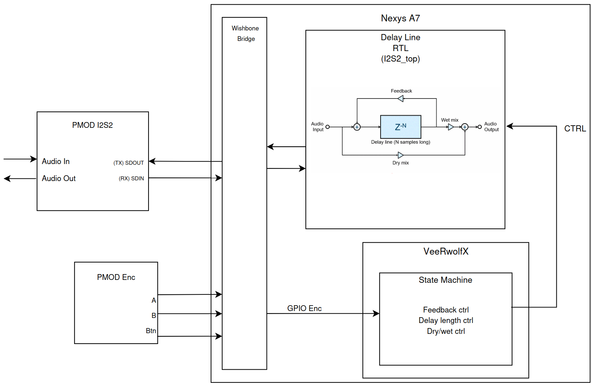
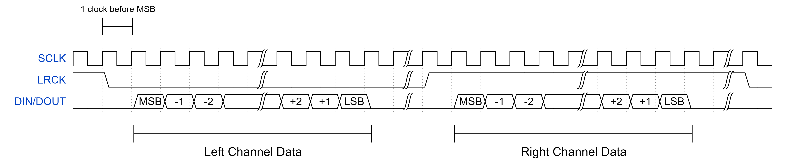
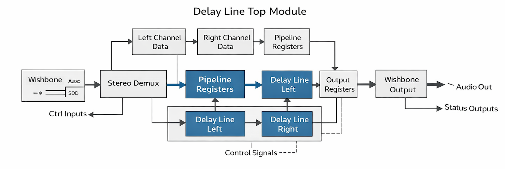
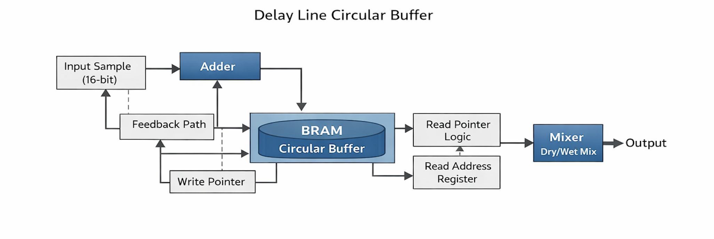
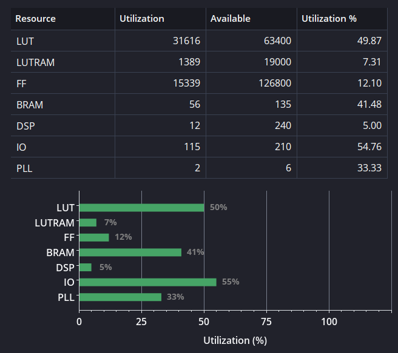
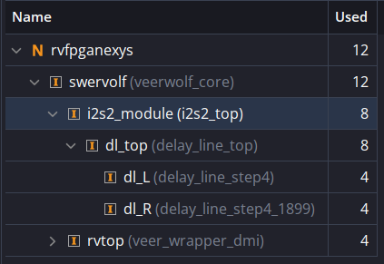

# FPGA-Based Audio Delay System — Nexys A7

> **ECE 540 Final Project · Portland State University · Spring 2026**
> Venkata Sriram Kamarajugadda · Aravindh Nanjaiya Latha · Navid Shamszadeh
>
> **Instructor:** Prof. Roy Kravitz, Senior Instructor Emeritus, ECE, MCECS, PSU

---

## Overview

This project implements a real-time audio delay effect on the **Nexys A7 FPGA board** running the **VeeRwolfX SoC** (a RISC-V based SoC). Audio is captured from a PMOD I2S2 peripheral, processed through a hardware delay line, and output back through the same peripheral. Delay length, feedback amount, and dry/wet mix are all controllable in real time via a PMOD rotary encoder.

The delay line is implemented entirely in RTL hardware to exploit the FPGA's DSP blocks and BRAM for low-latency audio processing. A software state machine running on the RISC-V core handles encoder input and writes control parameters to the hardware via MMIO registers.

---

## Signal Flow

```
Audio In  →  I2S2 RX  →  [Delay Line Top]  →  I2S2 TX  →  Audio Out
                               ↑   ↓
                          Feedback Loop
                               ↑
             RISC-V SW  →  MMIO Registers
             (delay_len, feedback, dry_wet)
                               ↑
                        Rotary Encoder
```

The delay effect implements the classic delay line model:

```
y[n] = dry * x[n]  +  wet * x[n − N]  +  feedback * y[n − N]
```

where `N` is the programmable delay length in audio samples.

---

## System Block Diagram



---

## Repository Structure

```
Audio-Delay-System-Nexys-A7/
│
├── HDL/                          # All hardware design files (SystemVerilog)
│   ├── Peripherals/                     # Custom audio processing modules
│   │   ├── bram.sv               # BRAM wrapper for circular buffer
│   │   ├── delay_line.sv         # Mono delay line: circular buffer, feedback, dry/wet mix
│   │   ├── delay_line_top.sv     # Stereo delay top: demux, dual mono instances, output mux
│   │   ├── i2s2.sv               # I2S receive/transmit protocol logic
│   │   └── i2s2_top.sv           # I2S2 top-level peripheral wrapper
│   ├── rvfpganexys.sv            # Top-level SoC integration (VeeRwolfX + custom peripherals)
│   └── veerwolf_core.v           # VeeRwolfX RISC-V SoC core
│
├── Software/
│   └── main.c                    # RISC-V firmware: FSM, encoder driver, MMIO writes
│
├── Constraints/
│   └── rvfpganexys.xdc           # Vivado pin constraints for Nexys A7
│
├── Report/
│   ├── report.pdf                # Final project report (March 2026)
│   └── *.png                     # Block diagrams and figures used in the report
│
├── rvfpganexys.bit               # Pre-built FPGA bitstream (ready to program)
└── LICENSE
```

---

## Hardware Design

### Platform

| Component | Details |
|---|---|
| FPGA Board | Digilent Nexys A7 (Artix-7 XC7A100T) |
| SoC | VeeRwolfX (RISC-V RV32IMC) |
| Audio Peripheral | PMOD I2S2 |
| Control Input | PMOD Rotary Encoder |
| HDL | SystemVerilog |
| Firmware | C (bare-metal, polling loop) |

### Clock Domains

| Domain | Frequency | Purpose |
|---|---|---|
| SoC Clock | 12.5 MHz | RISC-V core, Wishbone bus |
| MCLK | 22.579 MHz | Delay line + I2S2 processing |
| SCLK | ~2.822 MHz | I2S bit clock (MCLK / 8) |
| LRCLK | ~44.1 kHz | Audio sample rate (MCLK / 512) |

MCLK and the SoC clock share the same PLLE primitive. Cross-domain synchronization (SoC → delay line) uses a two-flip-flop synchronizer on an enable bit pulsed by software after each MMIO write.

---

### I2S Protocol



The I2S2 module (`i2s2.sv`) handles both audio receive and transmit. SCLK and LRCLK are generated from MCLK using a counter-based clock divider. The module is Wishbone compliant and uses `valid/ready/last` handshake signals (prefixed `rx_` or `tx_`) to interface with the delay line. Audio samples are 24 bits; the protocol streams continuously with no flow control.

---

### Delay Line Top Module



`delay_line_top.sv` integrates the I2S interface with the delay processing core:

- Demultiplexes the interleaved stereo stream into left (`in_L`) and right (`in_R`) channel registers
- Introduces a one-cycle pipeline stage for input timing stability
- Instantiates **two identical mono delay line instances** (`delay_line.sv`) in lockstep — one per channel
- Serializes processed outputs back into stereo format (left first, then right)
- Accepts Wishbone-controlled parameters (`delay_len`, `feedback`, `dry_wet`) dynamically at runtime
- Maintains continuous RX readiness to prevent deadlock during buffer initialization

---

### Delay Line Circular Buffer



`delay_line.sv` is the core signal processing module, instantiated once per channel:

- **BRAM circular buffer** (`bram.sv`): 24-bit input samples are truncated to **16-bit** before storage to conserve BRAM, then sign-extended back to 24-bit on output
- **Write pointer** (`write_ptr`): advances each valid sample; wraps automatically at fixed bit width
- **Read pointer**: computed as `read_ptr = write_ptr − delay_clamped`; delay is clamped to buffer capacity
- **BRAM latency compensation**: read address is registered one cycle early; dry signal path (`dry_pipe1`) is pipelined to match
- **Feedback path**: delayed output is scaled and summed into the write data before storage → recursive echo
- **Dry/wet mix**: fixed-point multiply-accumulate using FPGA DSP blocks
- **Startup mute**: `samples_written` counter suppresses output until the buffer is pre-filled to the programmed delay length

**Bit-width pipeline:** `24-bit input → 16-bit BRAM → 24-bit output`

---

### FPGA Resource Utilization

| Resource | Used | Available | Utilization |
|---|---|---|---|
| LUT | 31,616 | 63,400 | 49.87% |
| LUTRAM | 1,389 | 19,000 | 7.31% |
| FF | 15,339 | 126,800 | 12.10% |
| BRAM | 56 | 135 | 41.48% |
| DSP | 12 | 240 | 5.00% |
| IO | 115 | 210 | 54.76% |
| PLL | 2 | 6 | 33.33% |

The delay line itself uses only **8 DSP slices** (4 per channel: feedback and dry/wet multipliers). The remaining DSPs belong to the VeeRwolfX SoC.




---

## Software Design

`Software/main.c` runs on the RISC-V core as a bare-metal polling loop. Peripheral access uses `READ_REG` / `WRITE_REG` macros over volatile pointers.

### State Machine (6 States)

Each of the three parameters has two states — a **CTRL** state (encoder adjusts the value) and a **SEL** state (encoder navigates between parameters):

```
              enc_CW/CCW                           enc_CW/CCW
              (adjust)                             (adjust)
                 ↕                                    ↕
[reset] → CTRL_DRY_WET ↔ SEL_DRY_WET ↔ SEL_DELAY ↔ CTRL_DELAY
          (LED0 solid)    (LED0 blink)  (LED1 blink) (LED1 solid)
                                ↕
                         SEL_FEEDBACK ↔ CTRL_FEEDBACK
                         (LED2 blink)   (LED2 solid)
```

- **CTRL state**: rotate encoder → increment/decrement parameter → MMIO write
- **SEL state**: rotate encoder → cycle between parameters; press button → enter CTRL state
- **Button press in CTRL state** → return to matching SEL state

### Encoder Decoding

- Rising edge of Channel A detected in polling loop
- Channel B sampled on that edge determines direction (A≠B → CCW/increment; A=B → CW/decrement)
- ~8000 NOP-cycle debounce delay after each detected edge

### Parameter Scaling

All parameters are stored internally in display domain as integers in `[0, 100]` (steps of 5, 21 positions):

| Parameter | Hardware Register Scale |
|---|---|
| Dry/Wet Mix | `hw = display × 255 / 100` |
| Feedback Amount | `hw = display × 255 / 100` |
| Delay Length | `hw = display × 327` (samples) |

After each write, `DELAY_UPDATE_EN` is pulsed to latch the new values across the clock domain boundary via the two-FF synchronizer.

### User Feedback

| Indicator | State |
|---|---|
| LED0 solid | Dry/Wet in CTRL mode |
| LED0 blinking (~4 Hz) | Dry/Wet in SEL mode |
| LED1 solid | Delay Length in CTRL mode |
| LED1 blinking | Delay Length in SEL mode |
| LED2 solid | Feedback in CTRL mode |
| LED2 blinking | Feedback in SEL mode |
| 7-segment display | Current parameter value (0–100 in BCD) |

---

## How to Use

### Quick Start (Pre-built Bitstream)

1. Connect the Nexys A7 to your computer via USB
2. In Vivado Hardware Manager: open target → program device → select `rvfpganexys.bit`
3. Connect PMOD I2S2 and PMOD rotary encoder to their respective PMOD headers
4. Connect an audio source to I2S2 line in and headphones/speakers to line out
5. The system boots into **Dry/Wet control mode** (LED0 solid on)

### Building from Source

1. Open Vivado and add all files from `HDL/` as design sources
2. Add `Constraints/rvfpganexys.xdc` as the constraint file
3. Set `rvfpganexys.sv` as the top module
4. Run synthesis, implementation, and generate bitstream
5. Compile `Software/main.c` with a RISC-V RV32IMC cross-compiler and load onto the RISC-V core

### Operation

| Action | Effect |
|---|---|
| Rotate encoder (CTRL mode) | Adjust active parameter (shown on 7-seg, 0–100) |
| Press button (CTRL mode) | Switch to SEL mode (LED blinks) |
| Rotate encoder (SEL mode) | Navigate between parameters |
| Press button (SEL mode) | Enter CTRL mode for selected parameter |

---

## Team Contributions

| Member | Role |
|---|---|
| **Venkata Sriram Kamarajugadda** | Delay line RTL design, implementation, and verification (`delay_line.sv`, `delay_line_top.sv`, `bram.sv`) |
| **Aravindh Nanjaiya Latha** | Software state machine implementation, rotary encoder driver (`main.c`) |
| **Navid Shamszadeh** | I2S2 protocol design & implementation, clock generation, system integration, software debugging (`i2s2.sv`, `i2s2_top.sv`, `rvfpganexys.sv`) |

Full project repository (team lead): [nshamszadeh/ece540_final_project](https://github.com/nshamszadeh/ece540_final_project)

---

## Future Work

- **Higher fidelity**: Port to a lighter SoC to free BRAM for higher sample rates and full 24-bit storage
- **Potentiometer control**: Replace rotary encoder with ADC-interfaced potentiometers for continuous, intuitive control
- **Ping-pong delay**: Cross-feed L/R delay outputs for an immersive stereo bounce effect
- **Additional effects**: Extend the processing chain with reverb, chorus, or flanger modules

---

## References

- VeeRwolfX SoC / RVfpga platform documentation
- Digilent PMOD I2S2 reference design
- Digilent Nexys A7 board reference manual
- ECE 540 course materials, Portland State University, Spring 2026
